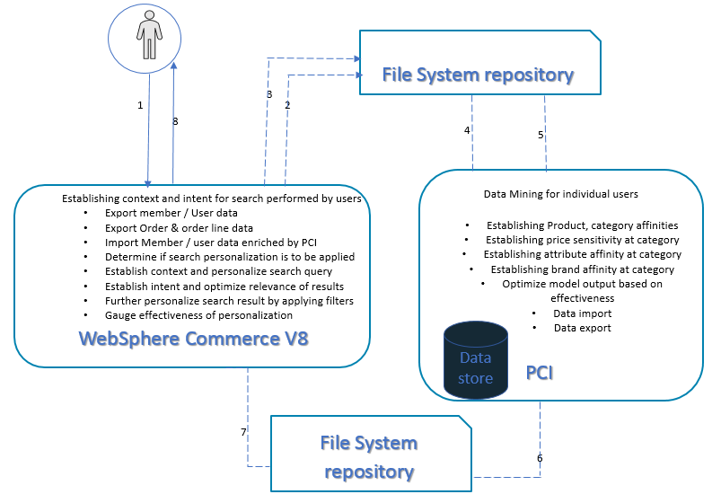
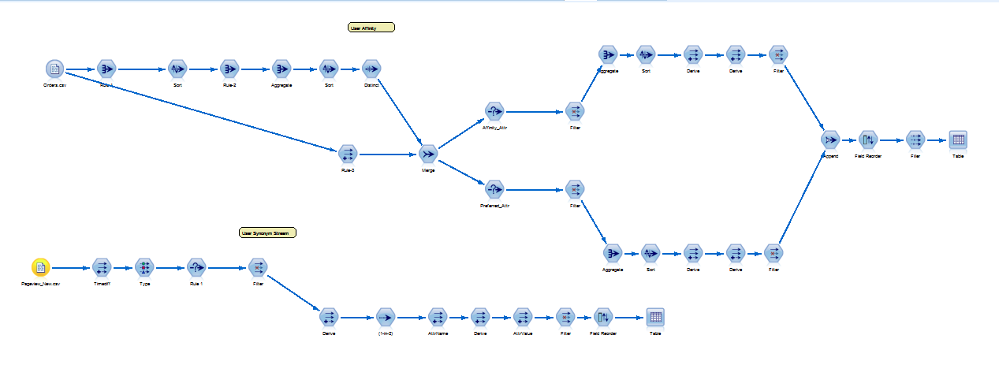
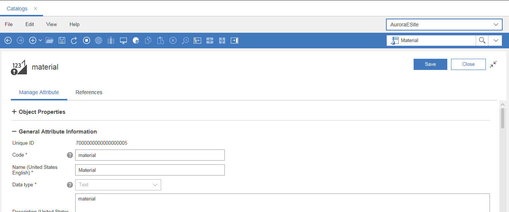
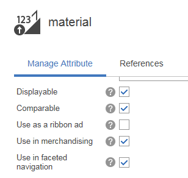

# Intent and Context driven personalization

Search is an integral component of most websites. Whether it be a content site or a commerce site. The search personalization capabilities available in COTS and generally implemented are still rudimentary rule based behavior and cater to a large set of users and therefore lacks hyper personalization. Through our journey you will be able to gauge the user’s context & intent and delivery an optimized, personalized search result and reduce the number of clicks for a user to get to the content or product.

This journey demonstrates a methodology to personalize search results, by identifying clear-cut affinities/preferences across various categories that the customer has ordered for in the past.

When the reader has completed this journey, they will understand how to develop search personalization and boost search results, in accordance with each customer’s preferences, using the IBM WebSphere Commerce and IBM PCI (Predictive Customer Intelligence).

The intended audience for this journey are architects and senior developers who want to deliver personalization to their product / content search functionality.

1.	User initiates search in WCS storefront
2.	User profile data is exported from WCS to a file repository
3.	Order data is exported from WCS to a file repository
4.	User profile data is imported into PCI from the file repository, for analysis.
5.	Order data is imported into PCI from the file repository, for analysis.
6.	The PCI models establish affinity for each user across various categories based on the order data from WebSphere Commerce. The User data enriched with scores and affinity attributes is churned out from PCI.
7.	This user-affinity data from PCI is fed into WebSphere Commerce and used to enrich the existing search – the affinity data is used to filter the search results.

## Included components

[WebSphere Commerce](http://www-03.ibm.com/software/products/en/websphere-commerce): IBM WebSphere Commerce is an omni-channel commerce platform that gives you the customer and business insight needed to engage shoppers as individuals with personalized content and offers, deliver mobile optimized experiences and more quickly respond to market opportunities to grow your business.

[Predictive Customer Intelligence](https://www.ibm.com/us-en/marketplace/predictive-customer-analytics): PCI is an analytical tool that helps with reaching customer objectives and improving customer experience by analyzing the available data and predicting next best actions. The analytics in PCI is driven by IBM SPSS Modeler.

## Features Technologies

1.	[Data Science](https://developer.ibm.com/code/technologies/data-science/): Systems and scientific methods to analyze structured and unstructured data in order to extract knowledge and insights.
2.	[Java](https://developer.ibm.com/code/technologies/java/) : A secure Object-oriented programming language, used to build applications. IBM Websphere Commerce is built using Java script, Java Server Pages and Java programming language.

# Watch The Video

To be updated

# Steps

Follow these steps to setup and run this developer pattern. The steps are described in detail below.

## 1.	Data capture from WCS

Execute the following query in DB to populate ATTR.FIELD1 that’s used to identify preferred/affinity attributes:

UPDATE ATTR SET FIELD1=1;
UPDATE ATTR SET FIELD1=0 WHERE ATTR_ID IN (SELECT ATTR_ID FROM ATTRDESC WHERE LANGUAGE_ID=-1 AND NAME IN ('Available Sizes'));
UPDATE ATTR SET FIELD1=0 WHERE ATTR_ID IN (SELECT ATTR_ID FROM ATTRDESC WHERE LANGUAGE_ID=-1 AND NAME IN (Size'));
UPDATE ATTR SET FIELD1=0 WHERE ATTR_ID IN (SELECT ATTR_ID FROM ATTRDESC WHERE LANGUAGE_ID=-1 AND NAME IN (Brand'));
UPDATE ATTR SET FIELD1=0 WHERE ATTR_ID IN (SELECT ATTR_ID FROM ATTRDESC WHERE LANGUAGE_ID=-1 AND NAME IN ('Price'));

 Use the data extraction utility in WCS to extract order and user data.

*	Extract the user profile details by using the data extract utility in WebSphere Commerce.
This is invoked by triggering the following command from WC_HOME/bin directory: dataextract.cmd  <path to wc-dataload.xml>
  
*	Extract the order details by triggering the following command from WC_HOME/bin directory:
dataextract.cmd  <path to wc-dataload.xml> wc-dataload.xml uses the configuration files - wc-extract-order.xml and wc-extract-users.xml

## 2.	Import the files into PCI
Select the starting node in PCI stream, and browse for the order and user files, exported from WCS.

## 3.	Churn out the user affinity-enriched files.

* The files are processed by the SPSS Modeler to associate with user affinity/preference data. The input files would be order & user files in csv format extracted from WCS.

*  The output files with the user-enriched data would be placed in the output path specified. The screenshot of the SPSS stream is below and the stream is available at the SPSS folder.

## 4.	Configurations in WCS Management Console
Enable Facet for your selected attribute like [eq: Material below](https://www.ibm.com/support/knowledgecenter/en/SSZLC2_8.0.0/com.ibm.commerce.management-center.doc/concepts/cpnfacets.htm)

CMC >> Catalog Tool >> Select Aurora Store >> Select Attribute Dictionary Attribute in the search box besides Material (as shown in screen1). Make attribute Facetable and searchable as shown in the screen below.

### Please follow the same process for all the selected attributes.

Screen 1:

Screen 2:

## 5.	Ensure that the custom code is all placed properly and server is restarted.

*	Changes done to the file wc-search.xml : searchProfile IBM_findProductsBySearchTerm changes to include a new provider, ExtSearchBoostExpressionProvider

*	GetUserAffinityDataBean : This data bean fetches the user attribute affinity and attribute preference.

*	ExtSearchDisplayCmdImpl : This is a new command which extends OOTB SearchDisplayCmd and performs search

*	GetSynonymDictionaryBySearchTermDB : This data bean fetches the user synonym dictionary based on the supplied search term.

*	SearchResultsDisplay.jsp : The changes done in this file includes the customization to display a personalized message for custom search “ Your search result page has been personalized. Please click here for non personalized search”. Clicking on the hyperlink for non-personalized search invokes the nonPersonalizeSearch() javascript function from Search.js. 

Also,a new dojo function is added to keep functionality working (fetching personalized and non-personalized results) even on page refresh. 

*	Search_UI.jspf : The form searchBox  in the jspf is changed and new param userPrefSearch is passed to ExtSearchDisplayCmd. This change is required to add in the two new checkboxes for Self and Gift,within the Search box.

*	Search.js : Two new javascript methods nonPersonalizeSearch() and userPreferredSearch() are added for out-of-box search and customized search. The latter is invoked on selecting the checkboxes introduced for Self and Gift search. 

*	SearchSetup.jspf : This file is modified to invoke GetUserAffinityDataBean and preferred attributes are passed to the search cluster.

## 6.	Database changes in WCS

CREATE TABLE USER_CAT_AFFINITY ( 
	USERS_ID BIGINT NOT NULL,    
    CATID BIGINT NOT NULL,
	BRAND VARCHAR (254),
	LASTUPDATE TIMESTAMP,	
	CONSTRAINT USER_CAT_PRICE_AFFINITY_PK PRIMARY KEY (USERS_ID, CATID), 
	CONSTRAINT USER_CAT_PRICE_AFFINITY_FK FOREIGN KEY (USERS_ID) REFERENCES USERS (USERS_ID) ON DELETE CASCADE	
);
CREATE TABLE USER_ATTR_AFFINITY ( 
	UATTR_ID BIGINT NOT NULL,
	USERS_ID BIGINT NOT NULL, 
	CATID BIGINT NOT NULL,
	ATTRFACETNAME VARCHAR (254),    
    ATTRFACETVALUE VARCHAR (254),
	ISATTRPREF INTEGER NOT NULL,
	LASTUPDATE TIMESTAMP,
	CONSTRAINT USER_ATTR_AFFINITY_PK PRIMARY KEY (UATTR_ID),
	CONSTRAINT USER_ATTR_AFFINITY_UK UNIQUE (USERS_ID, CATID, ATTRFACETNAME, ATTRFACETVALUE, ISATTRPREF), 
	CONSTRAINT USER_ATTR_AFFINITY_FK FOREIGN KEY (USERS_ID) REFERENCES USERS (USERS_ID) ON DELETE CASCADE,
	CONSTRAINT USER_ATTR_AFFINITY_UCAT_FK FOREIGN KEY (USERS_ID, CATID) REFERENCES USER_CAT_AFFINITY (USERS_ID, CATID) ON DELETE CASCADE
);

Make entry in KEYS/SUBKEYS tables

INSERT INTO KEYS VALUES((select  min(KEYS_ID)-1  from keys),'user_attr_affinity','UATTR_ID',10000,500,0,9223372036849999872,3,'0',1048576);

Execute below SQL statement by updating CMDREG 

INSERT INTO CMDREG (STOREENT_ID, INTERFACENAME, CLASSNAME, TARGET) VALUES (0, 'com.ibm.commerce.catalog.commands.SearchDisplayCmd', 'com.ext.commerce.catalog.commands.ExtSearchDisplayCmdImpl', 'Local');

## 7.	Login to WCS

Login into WCS as one of the existing users, who had placed prior orders across multiple categories. This data would have been analyzed by PCI and the user would have a strong affinity established.

## 8.	Category Search

Search for a category and notice that the search results are tuned in accordance with the brand/size affinity established by PCI.

# Troubleshooting

[See DEBUGGING.md.](DEBUGGING.md)

# License

[Apache 2.0](LICENSE)
